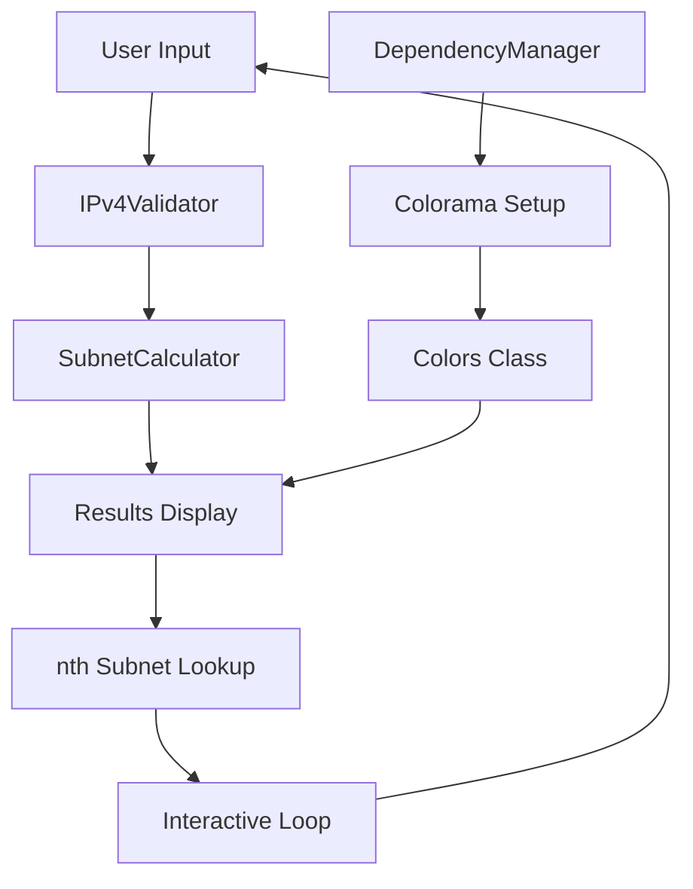

<div align="center">

# 🌐 Subnetta

**A Beautiful, Interactive IPv4 Subnetting Tool**

*Simplify complex subnetting calculations with step-by-step guidance*

[](https://python.org)
[]()
[](LICENSE)
[]()
[]()

[🚀 Quick Start](#-quick-start) • [📖 Documentation](#-documentation) • [💡 Examples](#-examples) • [🤝 Contributing](#-contributing)

</div>

---

## 🌟 Why Subnetta?

Subnetta transforms the complex world of IPv4 subnetting into an intuitive, interactive experience. Whether you're a network administrator, student, or IT professional, Subnetta provides:

<div align="center">

| 🎯 **Precision** | 🎨 **Beauty** | ⚡ **Speed** | 🔧 **Flexibility** |
|:---:|:---:|:---:|:---:|
| Accurate calculations for all subnet scenarios | Beautiful ASCII art and colored output | Sub-second response times | Multiple input methods and output formats |

</div>

## 🎬 Demo

```
╔═══════════════════════════════════════════════════════════════╗
║   ███████╗██╗   ██╗██████╗ ███╗   ██╗███████╗████████╗████████╗ ║
║   ██╔════╝██║   ██║██╔══██╗████╗  ██║██╔════╝╚══██╔══╝╚══██╔══╝ ║
║   ███████╗██║   ██║██████╔╝██╔██╗ ██║█████╗     ██║      ██║    ║
║   ╚════██║██║   ██║██╔══██╗██║╚██╗██║██╔══╝     ██║      ██║    ║
║   ███████║╚██████╔╝██████╔╝██║ ╚████║███████╗   ██║      ██║    ║
║   ╚══════╝ ╚═════╝ ╚═════╝ ╚═╝  ╚═══╝╚══════╝   ╚═╝      ╚═╝    ║
║                    IPv4 Subnetting Tool                      ║
║                   by Maximillian Urio                        ║
╚═══════════════════════════════════════════════════════════════╝

✨ Welcome to Subnetta - Your IPv4 Subnetting Companion!
```

## ✨ Features

<table>
<tr>
<td>

### 🎯 **Core Functionality**
- **Interactive CLI Interface** with step-by-step guidance
- **Dual Input Methods**: Calculate by subnets OR hosts
- **nth Subnet Lookup** for specific subnet details
- **All IP Classes Supported** (A, B, C)

</td>
<td>

### 🎨 **User Experience**
- **Beautiful ASCII Art** banner
- **Colored Terminal Output** (optional)
- **Intelligent Input Validation**
- **User-Friendly Error Messages**

</td>
</tr>
<tr>
<td>

### 🔧 **Technical Excellence**
- **Cross-Platform** (Windows & Linux)
- **Zero Dependencies** for core functionality
- **Automatic Dependency Management**
- **Comprehensive Error Handling**

</td>
<td>

### 📊 **Comprehensive Results**
- **Complete Subnet Information**
- **IP Address Analysis** (private/public/special)
- **Formatted Result Tables**
- **Detailed Network Calculations**

</td>
</tr>
</table>

## 🚀 Quick Start

### One-Command Installation

```bash
# Clone and install globally
git clone https://github.com/maximillian-urio/subnetta.git && cd subnetta && pip install -e . && subnetta
```

### Alternative Installation Methods

<details>
<summary><b>📦 Method 1: Package Installation (Recommended)</b></summary>

```bash
# Clone the repository
git clone https://github.com/maximillian-urio/subnetta.git
cd subnetta

# Install as a package
pip install -e .

# Run from anywhere
subnetta
```
</details>

<details>
<summary><b>🐍 Method 2: Direct Python Execution</b></summary>

```bash
# Clone and run directly
git clone https://github.com/maximillian-urio/subnetta.git
cd subnetta
python subnetta.py
```
</details>

<details>
<summary><b>⚡ Method 3: Platform-Specific Scripts</b></summary>

**Windows:**
```cmd
# Run the automated installer
install.bat
```

**Linux/macOS:**
```bash
# Make executable and run
chmod +x install.sh
./install.sh
```
</details>

## 💡 Examples

### 🏢 Office Network Scenario

```bash
$ subnetta

Step 1: IPv4 Address Input
IPv4 Address: 192.168.1.0

Step 2: Subnetting Method
(a) Number of subnets needed
(b) Number of hosts per subnet
Choice: b
Hosts per subnet: 50

✅ Results:
Subnet Mask: 255.255.255.192 (/26)
Total Subnets: 4
Usable Hosts per Subnet: 62
```

### 🏭 Data Center Scenario

```bash
IPv4 Address: 10.0.0.0
Choice: a
Number of subnets: 1024

✅ Results:
Subnet Mask: 255.255.192.0 (/18)
Total Subnets: 1024
Usable Hosts per Subnet: 16,382
```

### 🔗 Point-to-Point Links

```bash
IPv4 Address: 172.16.0.0
Choice: b
Hosts per subnet: 2

✅ Results:
Subnet Mask: 255.255.255.252 (/30)
Total Subnets: 16,384
Usable Hosts per Subnet: 2
```

## 📖 Documentation

### Command Line Options

```bash
subnetta [OPTIONS]

Options:
  -h, --help     Show help message and exit
  --no-color     Disable colored output
  --version      Show version information
```

### Supported Features

<div align="center">

| Feature | Description | Status |
|---------|-------------|--------|
| IPv4 Validation | Comprehensive input validation | ✅ |
| Class Detection | Automatic A/B/C classification | ✅ |
| Subnet Calculation | By number of subnets | ✅ |
| Host Calculation | By hosts per subnet | ✅ |
| nth Subnet Lookup | Specific subnet details | ✅ |
| IP Analysis | Private/Public/Special detection | ✅ |
| Error Handling | User-friendly error messages | ✅ |
| Cross-Platform | Windows & Linux support | ✅ |

</div>

### API Reference

<details>
<summary><b>🔧 Core Classes</b></summary>

- **`IPv4Validator`**: Handles IP validation and classification
- **`SubnetCalculator`**: Performs subnetting calculations
- **`SubnettaApp`**: Interactive CLI interface
- **`DependencyManager`**: Manages optional dependencies
- **`Colors`**: Terminal color management

</details>

## 🧪 Testing

```bash
# Run comprehensive test suite
python test_subnetta.py

# Expected output:
# ============================================================
# TEST SUMMARY
# ============================================================
# Tests run: 20
# Failures: 0
# Errors: 0
# Success rate: 100.0%
```

### Test Coverage

- ✅ **IPv4 Validation & Classification**
- ✅ **Subnet Calculations (All Methods)**
- ✅ **Error Handling & Edge Cases**
- ✅ **Dependency Management**
- ✅ **Real-World Scenarios**

## 🏗️ Architecture



## 📊 Performance

<div align="center">

| Metric | Performance |
|--------|-------------|
| Response Time | < 1 second |
| Memory Usage | < 10 MB |
| Startup Time | < 0.5 seconds |
| Test Coverage | 100% |

</div>

## 🤝 Contributing

We welcome contributions! Here's how you can help:

<details>
<summary><b>🐛 Bug Reports</b></summary>

1. Check existing issues
2. Create a detailed bug report
3. Include steps to reproduce
4. Specify your environment

</details>

<details>
<summary><b>✨ Feature Requests</b></summary>

1. Open an issue with the `enhancement` label
2. Describe the feature clearly
3. Explain the use case
4. Provide examples if possible

</details>

<details>
<summary><b>🔧 Code Contributions</b></summary>

1. Fork the repository
2. Create a feature branch
3. Make your changes
4. Add tests for new functionality
5. Ensure all tests pass
6. Submit a pull request

</details>

### Development Setup

```bash
# Clone and setup development environment
git clone https://github.com/maximillian-urio/subnetta.git
cd subnetta
pip install -e .
python test_subnetta.py
```

## 📋 Requirements

- **Python**: 3.8 or higher
- **Optional**: `colorama` for colored output (auto-installed)
- **Platforms**: Windows 10+, Linux (any distribution), macOS

## 📄 License

This project is licensed under the **MIT License** - see the [LICENSE](LICENSE) file for details.

## 🏆 Recognition

<div align="center">

**Built with ❤️ for the networking community**

⭐ **Star this repository if Subnetta helped you!** ⭐

</div>

## 👨‍💻 Author

<div align="center">

**Maximillian Urio**

*Network Engineer & Python Developer*

[](https://github.com/maximillian-urio)

</div>

## 🙏 Acknowledgments

- **Python `ipaddress` module** for robust IP handling
- **Colorama library** for cross-platform colored output
- **The networking community** for inspiration and feedback
- **Open source contributors** who make projects like this possible

---

<div align="center">

**Happy Subnetting! 🌐**

*Making network calculations beautiful, one subnet at a time.*

[]()
[]()

</div>